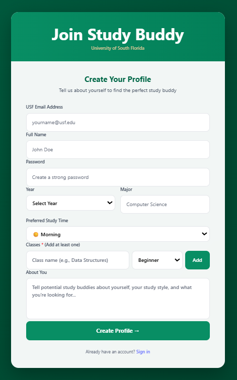
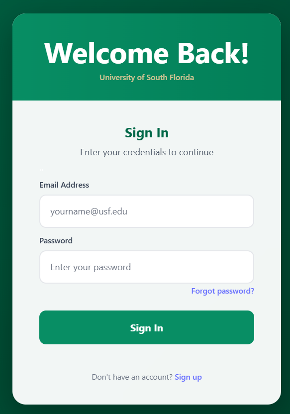
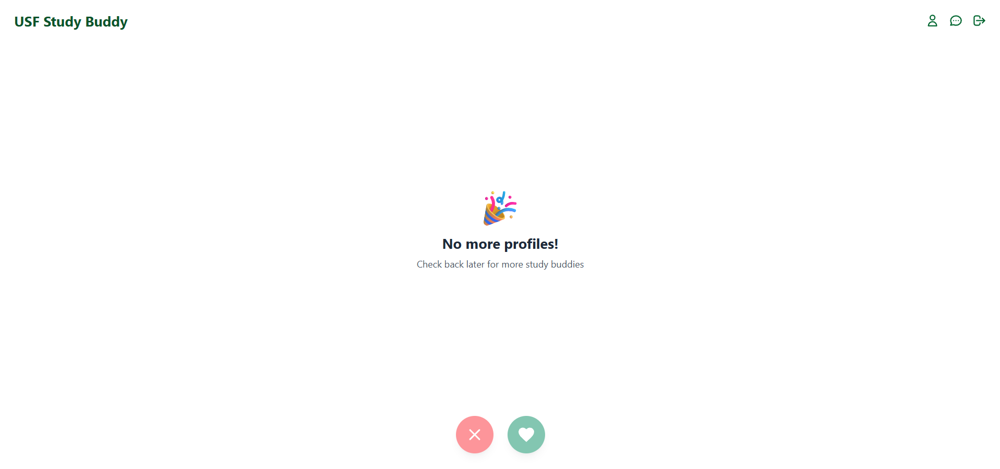

# 🎓 USF Study Buddy

<div align="center">

**Find your perfect study partner at USF with swipe-based matching**

[Getting Started](#-getting-started) • [Screenshots](#-screenshots) • [License](#-license)

</div>

---

## 📖 About

A Tinder-style web application designed to help University of South Florida students find compatible study partners. The project was designed for HackJam 2025.


## 🚀 Getting Started

### Prerequisites
- Python 3.9+
- Node.js 18+
- Poetry (Python package manager)
- npm or yarn

### Backend Setup

```bash
cd backend
poetry install
cp ../.env.example ../.env   # PLEASE CHANGE THE VARIABLES' VALUES
poetry run python main.py
```

The backend will run on `http://localhost:8000`

### Frontend Setup

```bash
cd frontend
npm install
npm run dev
```

The frontend will run on `http://localhost:5173`


## 📸 Screenshots







## 🎯 ToDo

- [ ] Real-time chat/messaging system  
- [ ] Email notifications for matches  
- [ ] Advanced filtering (by major, class, study time)  
- [ ] Study group creation (3+ people)  
- [ ] Calendar integration for scheduling study sessions  
- [ ] Rate limiting and API throttling  
- [ ] Profile pictures with cloud storage  
- [ ] Match history and statistics  
- [ ] Mobile app (React Native)


## 🤝 Contributing

This project was created for HackJam 2025. Contributions, issues, and feature requests are welcome!

1. Fork the repository
2. Create your feature branch (`git checkout -b feature/AmazingFeature`)
3. Commit your changes (`git commit -m 'Add some AmazingFeature'`)
4. Push to the branch (`git push origin feature/AmazingFeature`)
5. Open a Pull Request

## 📄 License

This project is licensed under the MIT License - see the [LICENSE](LICENSE) file for details.

---

<div align="center">

**Made with 💚 for USF Bulls**

</div>
